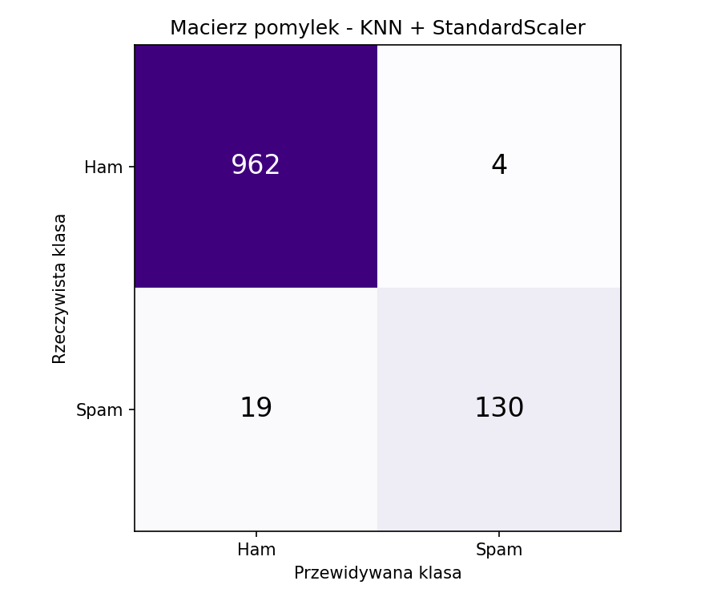
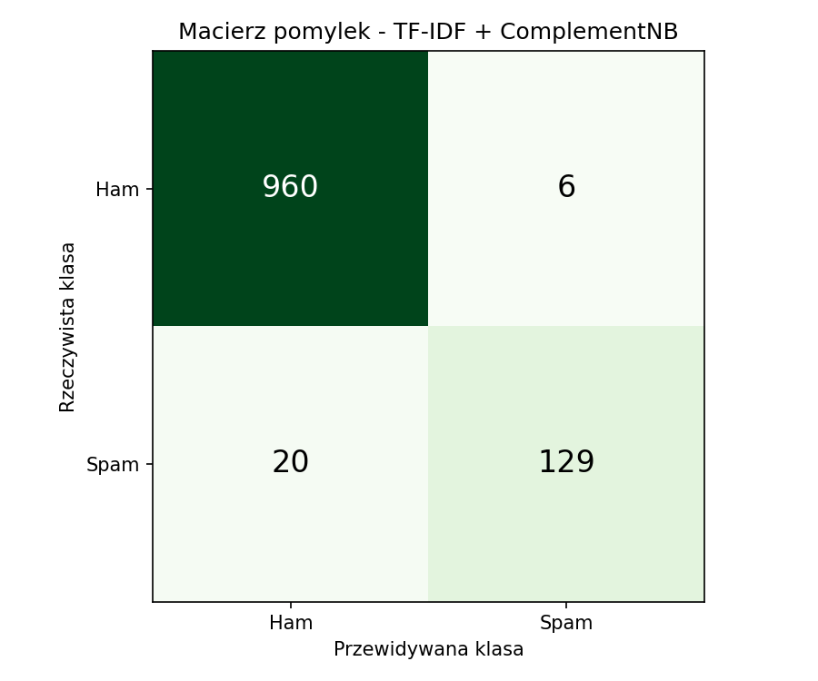
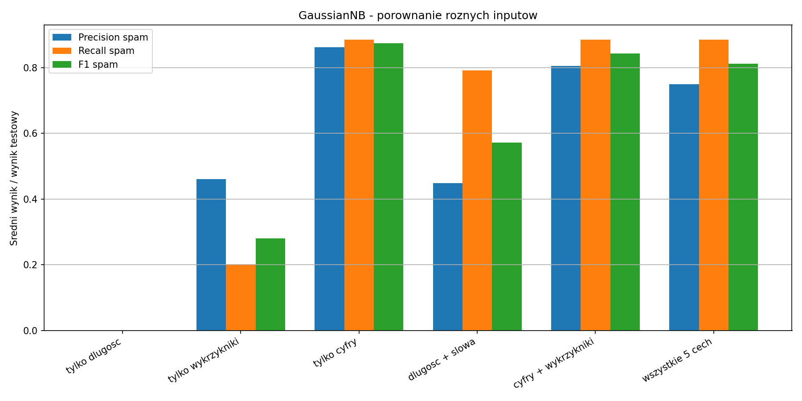
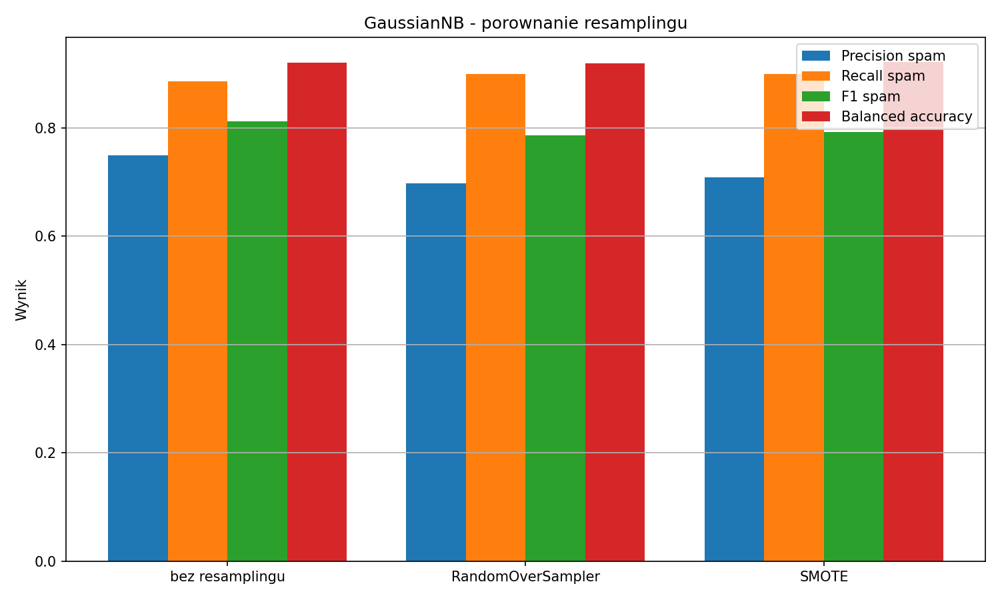
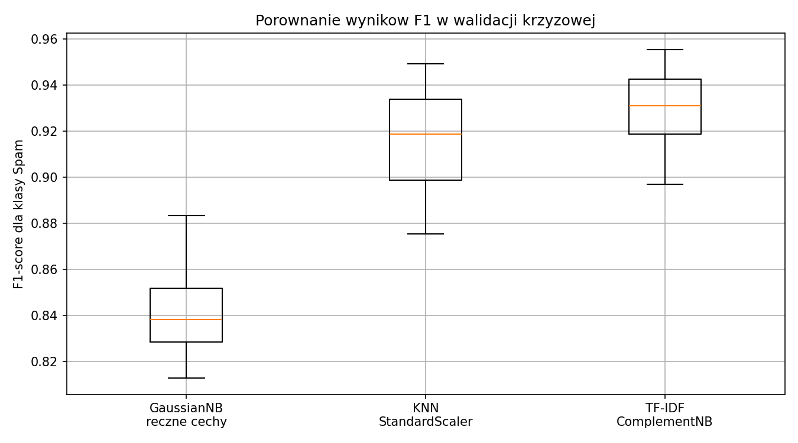

# Wykrywanie spamu w wiadomościach SMS — projekt AI

Projekt wykonany w ramach przedmiotu **Metody AI w badaniu zagrożeń w systemach komputerowych**.

Celem projektu jest rozpoznawanie, czy wiadomość SMS jest:

- **ham** — normalną wiadomością,
- **spam** — wiadomością niechcianą. 

Projekt zawiera analizę danych, trzy metody klasyfikacji, walidację krzyżową, analizę statystyczną oraz dodatkowe eksperymenty dodane po wskazówkach prowadzącego.

---

## Najważniejsze informacje o zbiorze danych

Wykorzystano zbiór **SMS Spam Collection**.

| Klasa | Liczba wiadomości | Udział |
|---|---:|---:|
| Ham | 4825 | 86.6% |
| Spam | 747 | 13.4% |
| Razem | 5572 | 100% |

Zbiór jest **niezbalansowany**, ponieważ wiadomości spam jest dużo mniej niż wiadomości normalnych. Dlatego oprócz `accuracy` analizowano też:

- `balanced_accuracy`,
- `precision` dla klasy spam,
- `recall` dla klasy spam,
- `F1-score` dla klasy spam,
- `ROC-AUC`,
- `PR-AUC`.

---

## Wizualizacja danych i modelu bazowego

Poniższy wykres pokazuje rozkład klas, zależność długości wiadomości od liczby słów, macierz pomyłek oraz krzywą ROC dla modelu GaussianNB.


---

## Metody wykorzystane w projekcie

### 1. GaussianNB + ręczne cechy

Pierwszy model wykorzystuje ręczne cechy SMS-a:

- długość wiadomości,
- liczba słów,
- liczba wielkich liter,
- liczba cyfr,
- liczba wykrzykników.

Model: **Gaussian Naive Bayes**.

Ten model sprawdza, czy spam da się rozpoznawać na podstawie tego, **jak wiadomość wygląda liczbowo**.

---

### 2. KNN + StandardScaler + ręczne cechy

Drugi model wykorzystuje te same ręczne cechy, ale inną metodę klasyfikacji: **KNN**, czyli k najbliższych sąsiadów.

Przed modelem użyto **StandardScaler**, ponieważ KNN liczy odległości między wiadomościami. Bez normalizacji jedna cecha, np. długość SMS-a, mogłaby za mocno wpływać na wynik.

Model: **KNeighborsClassifier(n_neighbors=5)**.

Ten model sprawdza, do jakich znanych wiadomości nowy SMS jest najbardziej podobny.



---

### 3. TF-IDF + ComplementNB

Trzeci model analizuje treść SMS-a.

Najpierw `TfidfVectorizer` zamienia tekst wiadomości na liczby, a potem `ComplementNB` klasyfikuje wiadomość jako spam albo ham.

Model: **TF-IDF + Complement Naive Bayes**.

Ten model sprawdza, **jakie słowa występują w wiadomości**.



---

## Parsowanie cech za pomocą regex

Po wskazówkach prowadzącego zmieniono sposób liczenia ręcznych cech na bardziej czytelny — z użyciem wyrażeń regularnych, czyli regexów.

Ważne: **nie dodano nowych typów cech**. Dalej używane są te same cechy co wcześniej:

- `dlugosc`,
- `slowa`,
- `wielkie`,
- `cyfry`,
- `wykrzykniki`.

Regex służy tylko do tego, żeby łatwiej pokazać i wytłumaczyć, jak wiadomość jest parsowana.

Przykładowo:

```python
re.findall(r'\b\w+\b', tekst)  # wyszukuje słowa
re.findall(r'\d', tekst)        # wyszukuje cyfry
re.findall(r'!', tekst)         # wyszukuje wykrzykniki
```

Dzięki temu można jasno powiedzieć, że z każdej wiadomości wyciągamy konkretne elementy tekstu i zamieniamy je na liczby.

---

## Dodatkowy eksperyment: GaussianNB na różnych wejściach

Dodano eksperyment, w którym ten sam model **GaussianNB** został uruchomiony na różnych zestawach cech.

Porównano:

- tylko długość,
- tylko wykrzykniki,
- tylko cyfry,
- długość + słowa,
- cyfry + wykrzykniki,
- wszystkie 5 cech razem.

Celem było sprawdzenie, czy wystarczy jedna cecha, para cech, czy lepszy jest pełny zestaw cech.



Wyniki pokazują, że pojedyncza cecha nie zawsze wystarcza. To nie jest problem — celem eksperymentu było właśnie porównanie różnych wejść.

---

## Dodatkowy eksperyment: RandomOverSampler i SMOTE

Ponieważ zbiór jest niezbalansowany, dodano porównanie metod resamplingu:

- bez resamplingu,
- **RandomOverSampler**,
- **SMOTE**.

RandomOverSampler powiela przykłady z klasy mniejszościowej, czyli spamu.

SMOTE tworzy nowe sztuczne przykłady klasy mniejszościowej na podstawie istniejących próbek w przestrzeni cech.



Wynik po resamplingu nie musi być zawsze lepszy. W tym projekcie chodziło o porównanie wpływu resamplingu na precision, recall, F1-score i balanced accuracy.

---

## Walidacja krzyżowa

Do głównego porównania modeli użyto:

```python
RepeatedStratifiedKFold(n_splits=5, n_repeats=5, random_state=42)
```

Oznacza to:

- 5 podziałów,
- 5 powtórzeń,
- 25 ocen każdego modelu.

Stratyfikacja jest ważna, ponieważ zbiór jest niezbalansowany i w każdym podziale powinniśmy zachować podobny udział spamu i hamu.



---

## Wyniki walidacji krzyżowej

| Model | Accuracy | Precision spam | Recall spam | F1 spam | ROC-AUC |
|---|---:|---:|---:|---:|---:|
| GaussianNB | 0.954 ± 0.006 | 0.788 ± 0.028 | 0.904 ± 0.027 | 0.841 ± 0.017 | 0.978 ± 0.007 |
| KNN + StandardScaler | 0.979 ± 0.005 | 0.961 ± 0.021 | 0.877 ± 0.032 | 0.917 ± 0.021 | 0.964 ± 0.011 |
| TF-IDF + ComplementNB | 0.982 ± 0.004 | 0.971 ± 0.010 | 0.894 ± 0.025 | 0.931 ± 0.015 | 0.983 ± 0.007 |

Najlepszy średni wynik F1-score dla klasy spam uzyskał model **TF-IDF + ComplementNB**.

---

## Analiza statystyczna

Do porównania modeli użyto testu Wilcoxona na wynikach F1-score dla klasy spam.

| Porównanie | p-value | Wniosek |
|---|---:|---|
| GaussianNB vs TF-IDF + ComplementNB | 5.96e-08 | różnica istotna |
| KNN vs TF-IDF + ComplementNB | 0.0010 | różnica istotna |
| GaussianNB vs KNN | 5.96e-08 | różnica istotna |

Ponieważ wartości `p-value` są mniejsze niż 0.05, różnice między modelami uznano za statystycznie istotne.

---

## Struktura repozytorium

W głównym folderze znajdują się README oraz obrazki, żeby GitHub od razu je wyświetlał.

Właściwy kod projektu znajduje się w folderze:

```text
sms-spam-ai-project-v2/
```

Najważniejsze pliki:

```text
.
├── README.md
├── projekt_gnb.png
├── histogram_prob.png
├── macierz_knn.png
├── macierz_tfidf.png
├── porownanie_f1_3modele_boxplot.png
├── gnb_porownanie_cech.png
├── resampling_gnb_porownanie.png
└── sms-spam-ai-project-v2/
    ├── main.py
    ├── requirements.txt
    ├── data/
    │   └── spam.csv
    ├── src/
    │   ├── data_preparation.py
    │   ├── experiments.py
    │   └── visualizations.py
    ├── docs/
    ├── figures/
    └── results/
```

---

## Instalacja i uruchomienie

Przejdź do folderu z kodem:

```bash
cd sms-spam-ai-project-v2
```

Zainstaluj wymagane biblioteki:

```bash
py -m pip install -r requirements.txt
```

Uruchom projekt:

```bash
py main.py
```

Po uruchomieniu program:

1. wczytuje dane,
2. parsuje wiadomości regexem do ręcznych cech,
3. trenuje trzy modele,
4. robi dodatkowe porównanie inputów dla GaussianNB,
5. porównuje RandomOverSampler i SMOTE,
6. wykonuje walidację krzyżową,
7. wykonuje test Wilcoxona,
8. zapisuje wykresy w folderze `figures/`.

---

## Wnioski

Najważniejsze wnioski:

- zbiór jest niezbalansowany, więc sama accuracy nie wystarcza,
- GaussianNB jest dobrym prostym modelem bazowym,
- KNN po normalizacji działa dobrze na ręcznych cechach,
- TF-IDF + ComplementNB najlepiej wykorzystuje treść wiadomości,
- regex ułatwia wytłumaczenie, jak stare cechy zostały policzone,
- pojedyncze cechy nie zawsze dają dobre wyniki,
- RandomOverSampler i SMOTE pomagają sprawdzić wpływ wyrównania klas,
- gorszy wynik w niektórych wariantach nie jest błędem — celem eksperymentów było porównanie wpływu różnych wejść i metod przygotowania danych.

---

## Krótkie podsumowanie

Projekt nie tylko wybiera najlepszy model, ale też sprawdza, **dlaczego** dany model działa lepiej lub gorzej. Porównano różne klasyfikatory, różne wejścia dla GaussianNB oraz wpływ resamplingu na dane niezbalansowane.
