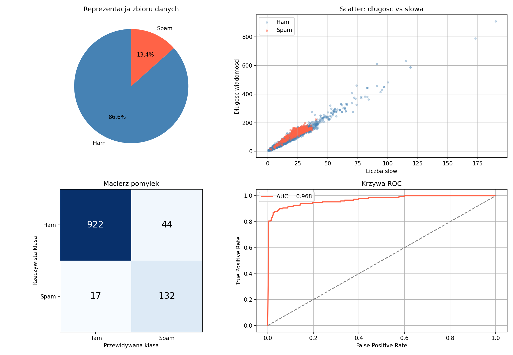

# P1 — Wizualizacja zbioru danych i określenie problemu rozpoznawania

## Problem

Projekt dotyczy klasyfikacji wiadomości SMS jako:

- `ham` — wiadomość normalna,
- `spam` — wiadomość niechciana.

Jest to problem **klasyfikacji binarnej**.

## Zbiór danych

Wykorzystano zbiór SMS Spam Collection zawierający 5572 wiadomości.

| Klasa | Liczba | Udział |
|---|---:|---:|
| Ham | 4825 | 86.6% |
| Spam | 747 | 13.4% |

Zbiór jest niezbalansowany, dlatego w dalszej ocenie modeli zastosowano nie tylko accuracy, ale też precision, recall, F1-score i balanced accuracy.

## Wizualizacje

W projekcie przygotowano:

- wykres kołowy udziału klas,
- scatter długości wiadomości względem liczby słów,
- podstawowe wykresy wyników.

